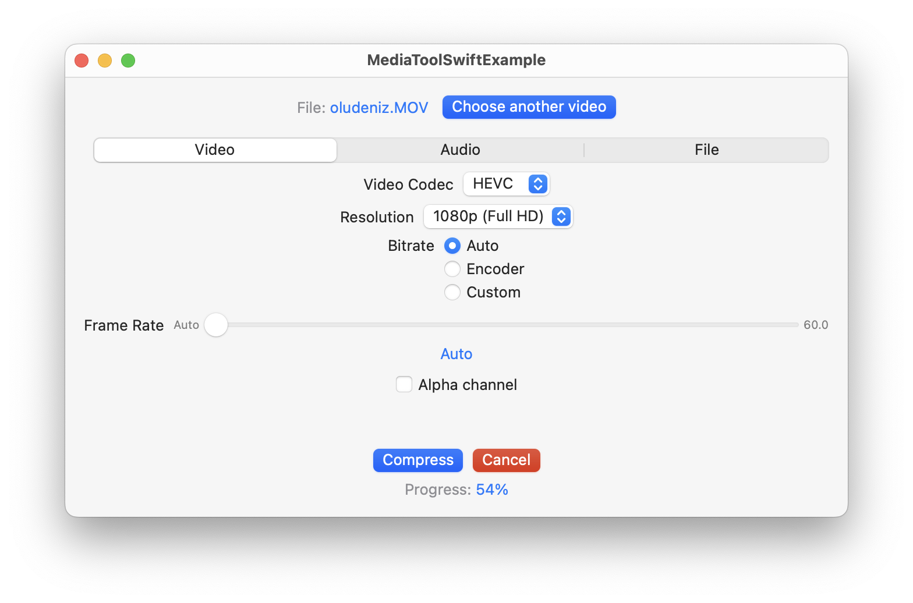
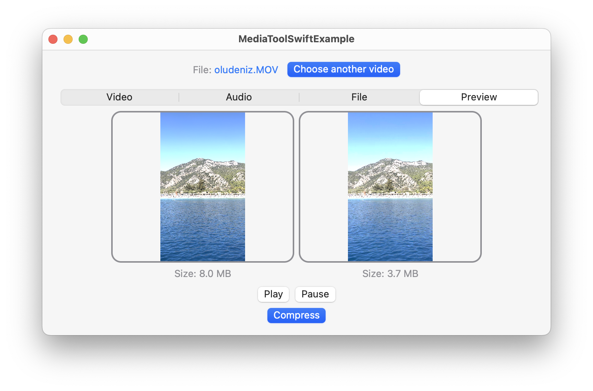
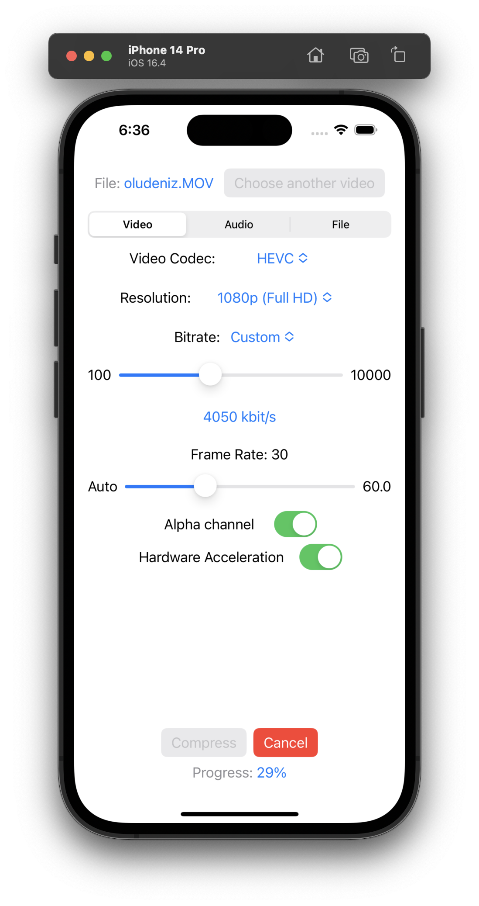

# MediaToolSwiftExample
> Demo application for MediaToolSwift

# Screenshots
| Setup | Preview |
| ------------ | ------------ |
|||

<!--# Screenshots
| macOS | iOS |
| ------------ | ------------ |
|<table><tr><td></td></tr><tr><td></td></tr></table>||-->
